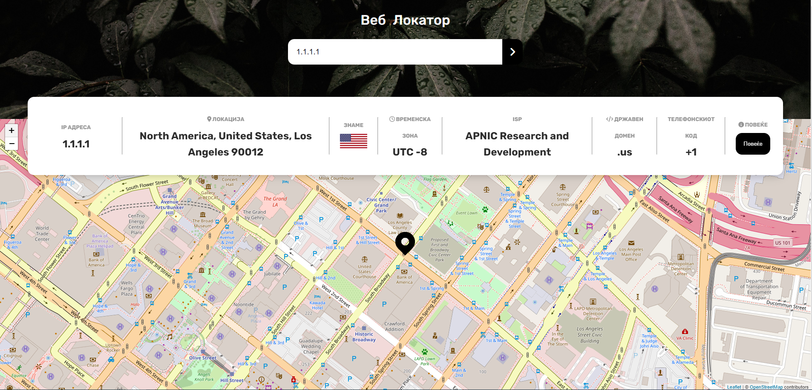

# [MK]

# Веб Локатор

Веб Локаторот е апликација што овозможува лесно и брзо пребарување и приказ на информации за дадена IP адреса или домен. Корисниците можат да внесат IP адреса или домен во формуларот за пребарување и добиваат детални информации за локација, временска зона, интернет сервис провајдер, државен домен, и други.

### Преглед

### Во живо

Можете да го проверите во живо [тука](https://xstephx.github.io/web-locator/).

### Користени технологии

- HTML5
- CSS (Со Font Awesome и Google Fonts)
- JavaScript
- jQuery
- Leaflet за мапата
- ipgeolocation.io API за добивање на податоци за локацијата

### Автор

Стефан Бојковски

### 🚀🚀🚀

---

# [EN]

# Web Locator

Web Locator is an application that allows easy and quick search and display of information for a given IP address or domain. Users can enter an IP address or domain in the search form and receive detailed information about location, time zone, internet service provider, country code, and more.

### Overview

### Live 

You can check live [here](https://xstephx.github.io/web-locator/).

### Technologies Used

- HTML5
- CSS (With Font Awesome and Google Fonts)
- JavaScript
- jQuery
- Leaflet for the map
- ipgeolocation.io API for obtaining location data

### Author

Stefan Bojkovski

### 🚀🚀🚀
